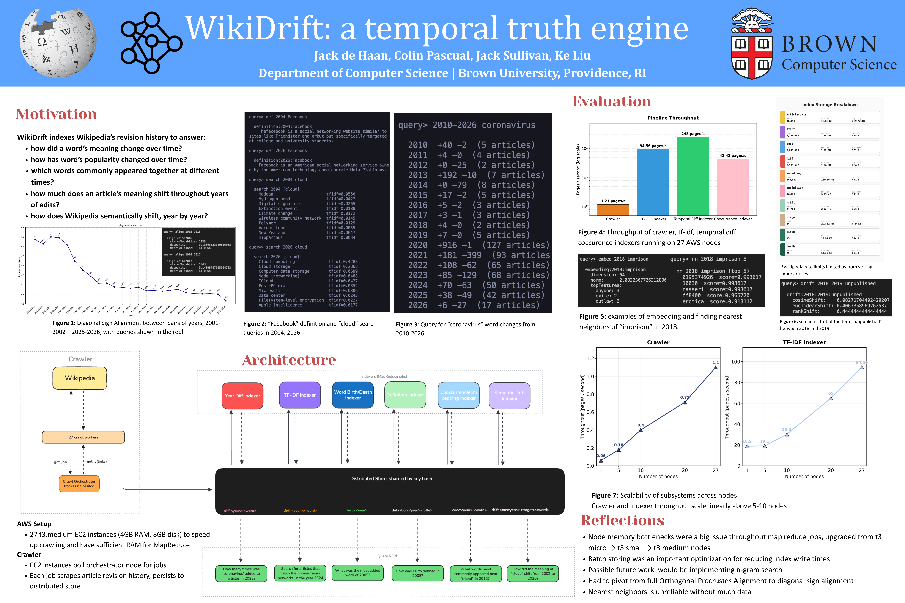
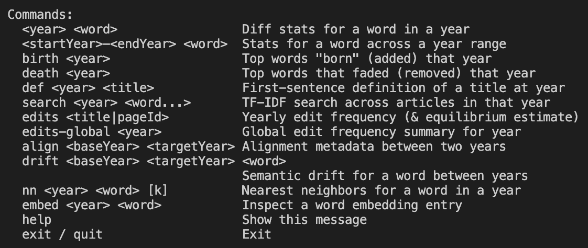
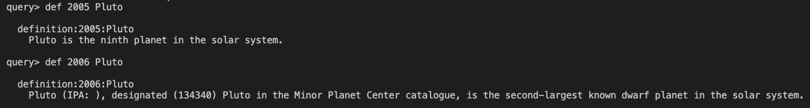
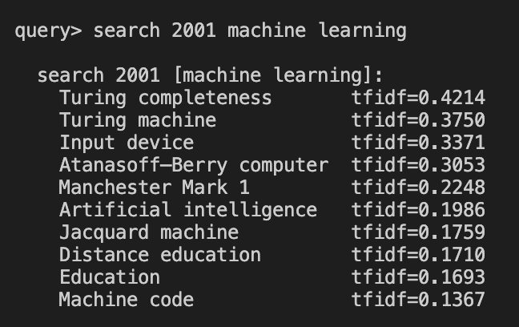
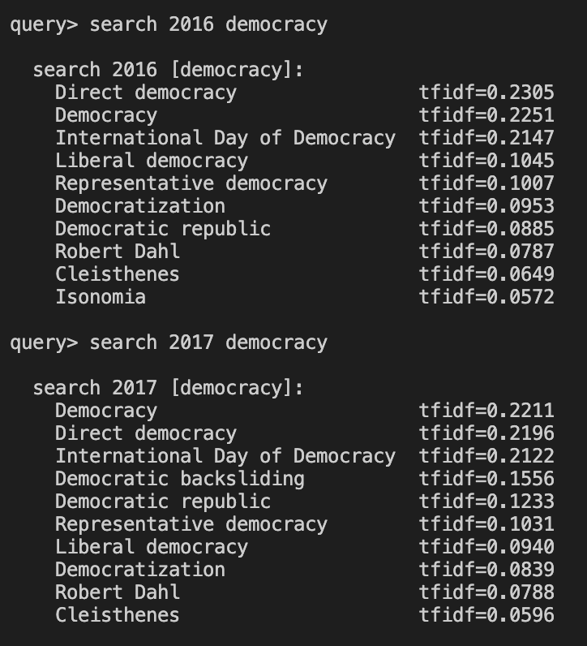
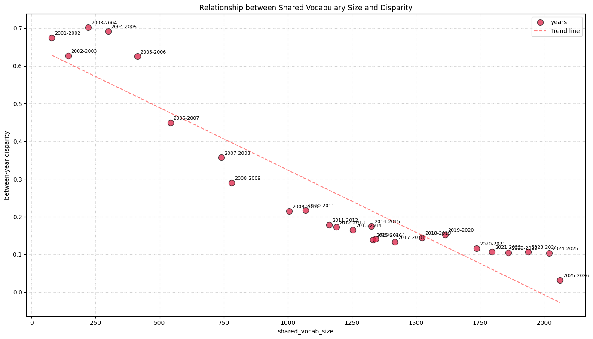
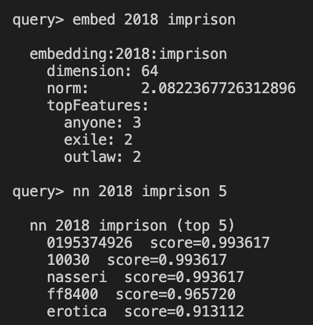
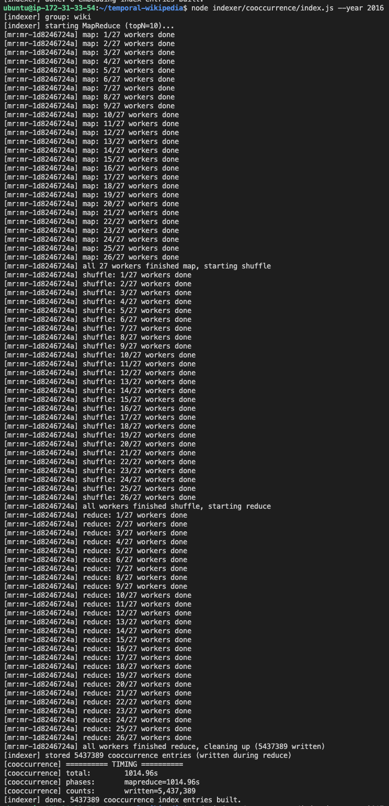

# WikiDrift: a temporal truth engine

WikiDrift indexes Wikipedia’s revision history to answer:

- how did a word’s meaning change over time?
- how has word’s popularity changed over time?
- which words commonly appeared together at different times?
- how much does an article’s meaning shift throughout years of edits?
- how does Wikipedia semantically shift, year by year?
- and more!

More details can be found on our [poster](https://www.canva.com/design/DAHGOCAFwVA/l6COhWruKaaMjw3UcmgorQ/view):
>)

# Appendix

During our presentation, we had additional data that we couldn't fit on our poster:

### List of commands for the wikidrift engine:

### Definition change of Pluto between 2005 and 2006

### Tf-idf scores of "machine learning" in 2001

### Difference of tf-idf scores of "democracy" between 2016 and 2017. Which article shot up as more significant to the term "democracy" between those two years?

### The trend of shared vocab size (number of shared terms across the articles we scraped) and the calculated between-year disparity.

### Embedding and nearest neighbor terms of "imprison" in 2018

While these nearest neighbors don’t seem significant, the meanings of the terms are quite interesting:

- 0195374926 is the ISBN for the book “Handbook of Language and Ethnic Identity: Disciplinary and Regional Perspectives”
- 10030 is the zip code for Harlem, NYC, which has a correctional facility
- “nasseri” likely refers to Mehran Karimi Nasseri, the Iranian refugee who lived in the Terminal 1 transit area of Paris-Charles de Gaulle Airport for 18 years
- ff8400 is a hex code for a shade of orange used in American orange prison jumpsuits.
  

### Output of running MapReduce on the cooccurrence indexing in 2016

